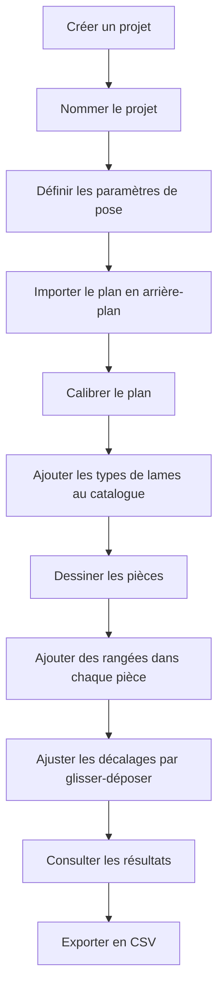

# Calepinage — Documentation

> **Source de vérité du projet.** À lire en premier à chaque session.

## Vue d'ensemble

**Calepinage** est une application web de calcul de pose de parquet flottant. Elle s'adresse à toute personne souhaitant planifier une pose rectiligne : particulier bricoleur, artisan ou décorateur.

L'objectif principal est double :

1. **Visualiser** la disposition des lames dans chaque pièce, en dessinant les contours à main levée sur un plan importé.
2. **Optimiser les coûts** en calculant automatiquement la réutilisation des chutes entre rangées et entre pièces, afin de minimiser les achats et les pertes matière.

L'application est entièrement front-end, sans serveur, et fonctionne hors-ligne après le premier chargement. Toutes les données sont stockées localement dans le navigateur via IndexedDB. Il n'y a aucun compte utilisateur, aucune synchronisation cloud : tout reste sur la machine de l'utilisateur.

L'espace de travail se compose de trois zones fonctionnelles :

- **La zone SVG centrale** : le canvas interactif où s'affichent le plan importé, les pièces dessinées et les lames calculées.
- **Les panneaux latéraux** : paramètres du projet, catalogue de types de lames, paramètres de pose, résultats et export.
- **La barre d'outils** : bascule entre les modes d'interaction, sélecteur de pièce active et ajout de rangées.

---

## Scénario utilisateur classique

### Créer et configurer un projet

Au lancement, l'utilisateur crée un nouveau projet et lui donne un nom. Plusieurs projets peuvent coexister. Une fois le projet créé, il définit les **paramètres de pose** :

| Paramètre | Description | Défaut |
| --- | --- | --- |
| Cale de dilatation | Espace entre les lames et chaque mur. Largeur disponible = largeur pièce − 2 × cale. | 0,5 cm |
| Largeur de la lame de scie | Épaisseur de l'outil de découpe, déduite de la longueur brute d'une chute. | 0,1 cm |
| Longueur minimale de lame | En dessous de cette valeur, une lame est considérée invalide. | 30 cm |
| Écart minimal entre fins de rangées | Contrainte esthétique entre deux rangées consécutives du même type. | 15 cm |

### Étapes suivantes

1. Importer et calibrer le plan → voir [Plan en arrière-plan](features/background-plan.md)
2. Constituer le catalogue de lames → voir [Gestion de projets](features/project-management.md)
3. Dessiner les pièces → voir [Dessin de pièces](features/room-drawing.md)
4. Ajouter et ajuster les rangées → voir [Remplissage des rangées](features/row-fill.md) et [Glisser-déposer](features/row-drag.md)
5. Consulter les résultats → voir [Annotations et contraintes](features/constraints-annotations.md)

---

## Index de la documentation

### Fonctionnalités

| Fichier | Contenu |
| --- | --- |
| [features/interaction-modes.md](features/interaction-modes.md) | Les 4 modes de la barre d'outils (nav, dessin, plan, lames) |
| [features/room-drawing.md](features/room-drawing.md) | Dessin de pièces polygonales à angles droits |
| [features/background-plan.md](features/background-plan.md) | Import, calibration et opacité du plan de fond |
| [features/row-fill.md](features/row-fill.md) | Algorithme de remplissage automatique des rangées |
| [features/row-drag.md](features/row-drag.md) | Glisser-déposer des rangées et preview temps réel |
| [features/constraints-annotations.md](features/constraints-annotations.md) | Indicateurs visuels de contraintes + annotations de réutilisation |
| [features/canvas-navigation.md](features/canvas-navigation.md) | Zoom, pan et navigation clavier dans le canvas |
| [features/project-management.md](features/project-management.md) | Gestion multi-projets, reprise de session, clonage |

### Technique

| Fichier | Contenu |
| --- | --- |
| [technical/architecture.md](technical/architecture.md) | Stack, séparation des responsabilités, flux de données |
| [technical/data-model.md](technical/data-model.md) | Modèle de données IndexedDB, ce qui est stocké vs calculé |
| [technical/code-conventions.md](technical/code-conventions.md) | Conventions TypeScript, imports, CSS, taille des fichiers |

### Références

| Fichier | Contenu |
| --- | --- |
| [glossary.md](glossary.md) | Définitions des termes métier |
| [project-steps/](project-steps/) | Étapes de développement et état d'avancement |
| [images/](images/) | Maquettes et wireframes |
