# Plan en arrière-plan

Le plan joue un rôle de guide passif : l'utilisateur s'en sert pour tracer les pièces avec précision, mais il n'est ni analysé ni interprété par l'application.

Disponible en mode **Plan** (`plan`).

## Affichage et dimensionnement

L'image est affichée comme élément `<image>` SVG et dimensionnée en **unités monde** (centimètres). Cette décision garantit que le plan participe naturellement au zoom et au pan du canvas. Les dimensions sont calculées au chargement en lisant `naturalWidth` et `naturalHeight` de l'image, puis en appliquant l'échelle de calibration.

## Flux d'import et calibration

```mermaid
flowchart LR
    Upload[Upload image File] --> Store[Stocker le File nativement dans IndexedDB]
    Store --> ObjUrl[URL.createObjectURL file]
    ObjUrl --> Img[new Image - lire naturalWidth et naturalHeight]
    Img --> Display[Afficher en unités monde]
    Display --> Calib{Calibrer ?}
    Calib -- Oui --> P1[Choisir point 1 sur le plan]
    P1 --> P2[Choisir point 2 sur le plan]
    P2 --> Dist[Saisir la distance réelle en cm]
    Dist --> Scale[Calculer l'échelle px → cm]
    Scale --> Done([Plan calibré])
    Calib -- Non --> Done
```



L'image est un `File` directement stocké dans IndexedDB — pas de conversion base64. Au chargement, un object URL temporaire est créé via `URL.createObjectURL(file)` pour alimenter un `<image>` SVG. L'object URL est révoqué (`URL.revokeObjectURL`) dès qu'il n'est plus nécessaire.

La calibration peut être refaite à tout moment sans perdre les pièces déjà dessinées : elles sont définies en coordonnées monde et s'adaptent automatiquement à la nouvelle échelle.

**Sans calibration** : l'échelle par défaut est 1 px = 1 cm. Le plan s'affiche et l'utilisateur peut dessiner des pièces, mais les dimensions calculées seront incorrectes.

## Repositionnement

En mode `plan`, l'utilisateur peut glisser l'image pour l'aligner avec les pièces déjà dessinées. La position est stockée dans les champs `x` et `y` de `BackgroundPlan` (en unités monde, cm).

## Rotation

La rotation (±90°) est non destructive : elle s'applique par transformation sans modifier les données stockées.

## Opacité

Le slider disponible en mode `plan` permet de doser la visibilité du plan entre 0 % et 100 %. La valeur est persistée dans `BackgroundPlan.opacity`.

## Technique de contraste pour les annotations

Toutes les annotations textuelles utilisent du texte blanc avec un contour coloré rendu en premier (`paintOrder: stroke`). Le contour crée un halo garantissant la lisibilité quelle que soit l'image sous-jacente :

```
fill        = "white"
stroke      = "black" | "#dc2626"   /* noir si lien identifié, rouge si perte potentielle */
strokeWidth = 2.5 / zoom            /* constant en pixels écran, quel que soit le zoom     */
paintOrder  = "stroke"              /* contour dessiné avant le texte                      */
```
