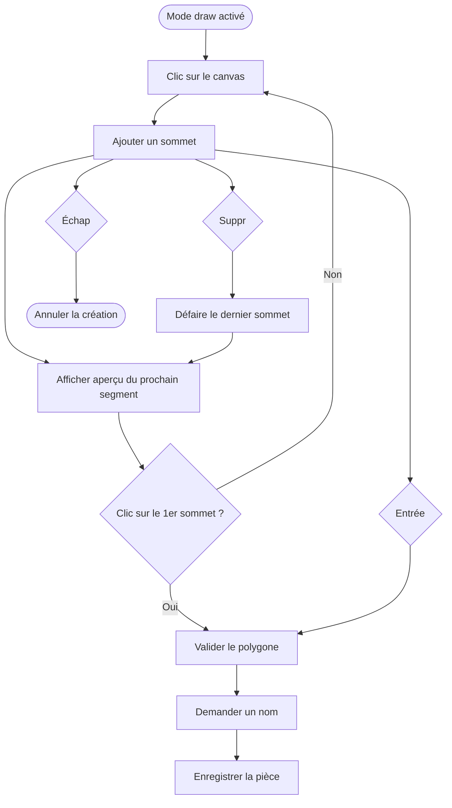

# Dessin de pièces

Disponible en mode **Nouvelle pièce** (`draw`). L'utilisateur pose des sommets un par un pour former un polygone. Les pièces peuvent avoir des murs diagonaux — la contrainte 90° est levée. Le snap axial (`Ctrl` + drag) permet d'aligner facilement les sommets sans forcer des angles droits.

## Flux de création

## Snap axial

Disponible pendant la création (`Ctrl` + drag sur le dernier sommet posé) et pendant l'édition (`Ctrl` + drag sur un sommet existant).

**Seuil :** `12 px` à l'écran (constant quel que soit le zoom — la conversion en cm monde se fait via `threshold_world = 12 / zoom`).

**Deux axes indépendants :** le point cherche à s'accrocher **simultanément** à l'axe X **et** à l'axe Y d'un sommet existant, évalués séparément :

- Si la distance horizontale au X d'un sommet `V` est ≤ 12 px → snap en X sur `V.x`.
- Si la distance verticale au Y d'un sommet `V'` (potentiellement différent de `V`) est ≤ 12 px → snap en Y sur `V'.y`.

Les deux accroches peuvent être actives en même temps (cas classique de l'alignement sur un coin de pièce déjà tracé). Une ligne guide colorée (couleur distincte du contour) est affichée pour chaque axe actif.

Le snap est optionnel — sans `Ctrl`, le sommet se pose librement, permettant des murs diagonaux.

## Raccourcis clavier

| Touche | Action |
| --- | --- |
| `Suppr` | Annule le dernier sommet placé |
| `Échap` | Abandonne entièrement la pièce en cours, sans rien enregistrer |
| `Entrée` | Valide la pièce avec les sommets actuels et ouvre la saisie du nom |

## Comportement sur changement de mode

Si l'utilisateur change de mode sans appuyer sur `Entrée`, les sommets en cours sont abandonnés. Aucune pièce partielle n'est enregistrée dans IndexedDB.

## Édition des sommets d'une pièce existante

Disponible en mode `edit` sur une pièce **sans rangées**. Voir [interaction-modes.md](interaction-modes.md).
