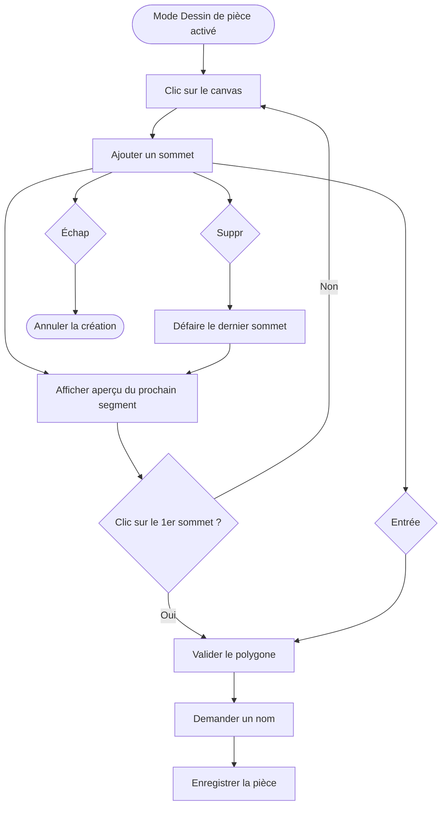

# Dessin de pièces

Disponible en mode **Dessin de pièce** (`add-room`). L'utilisateur pose des sommets un par un ; chaque sommet est automatiquement contraint à partager sa coordonnée X ou Y avec le sommet précédent, garantissant des angles droits.

## Flux de création

## Snap à 90°

À chaque déplacement de la souris, l'application compare le delta horizontal et le delta vertical depuis le dernier sommet. L'axe avec le plus grand delta l'emporte — le point prévisualisé est aligné sur l'autre coordonnée du point précédent. Ce comportement est automatique et transparent pour l'utilisateur.

## Raccourcis clavier

| Touche | Action |
| --- | --- |
| `Suppr` | Annule le dernier sommet placé |
| `Échap` | Abandonne entièrement la pièce en cours, sans rien enregistrer |
| `Entrée` | Valide la pièce avec les sommets actuels et ouvre la saisie du nom |

## Comportement sur changement de mode

Si l'utilisateur change de mode sans appuyer sur `Entrée`, les sommets en cours sont purement abandonnés. Aucune pièce partielle n'est enregistrée dans IndexedDB.
