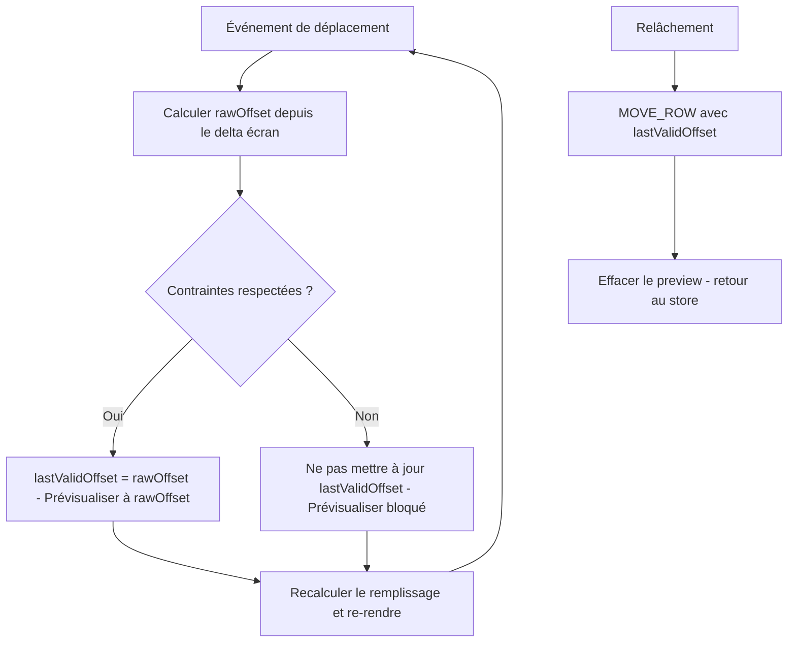

# Glisser-déposer des rangées

Disponible uniquement en mode **Lames** (`edit-rows`). L'utilisateur ajuste le décalage du motif d'une rangée en la glissant horizontalement.

## Calcul du déplacement

Glisser à droite déplace les joints vers la droite, ce qui correspond à une **diminution** de `xOffset` :

```
xOffset = offsetInitial − (positionCouranteSouris − positionDépart) / zoom
```

Le déplacement est converti de l'espace écran vers l'espace monde en divisant par le niveau de zoom, garantissant un comportement cohérent quelle que soit l'échelle.

## Flux de drag



## Blocage dur sur positions invalides

À chaque position candidate, les contraintes sont vérifiées. Si la position est invalide, `lastValidOffset` n'est pas mis à jour et les lames restent bloquées visuellement, même si le curseur continue d'avancer. Au relâchement, `lastValidOffset` est toujours commité — **jamais une position invalide**.

## Preview en temps réel

Pendant le drag, les lames se repositionnent à chaque événement **sans toucher au store**. Ce n'est qu'au relâchement que l'action `MOVE_ROW` est dispatchée et persistée dans IndexedDB.

## Retour visuel

Pendant le drag : la rangée passe à 70 % d'opacité et ses contours basculent vers la couleur d'accent (`--accent`).

## Cascade au relâchement

Toutes les rangées suivantes du même type dans la même pièce sont recalculées — leurs `xOffset` sont dérivés de la chute de la rangée déplacée.

Voir aussi [row-fill.md](row-fill.md) pour l'algorithme de remplissage et [constraints-annotations.md](constraints-annotations.md) pour les indicateurs visuels pendant le drag.
