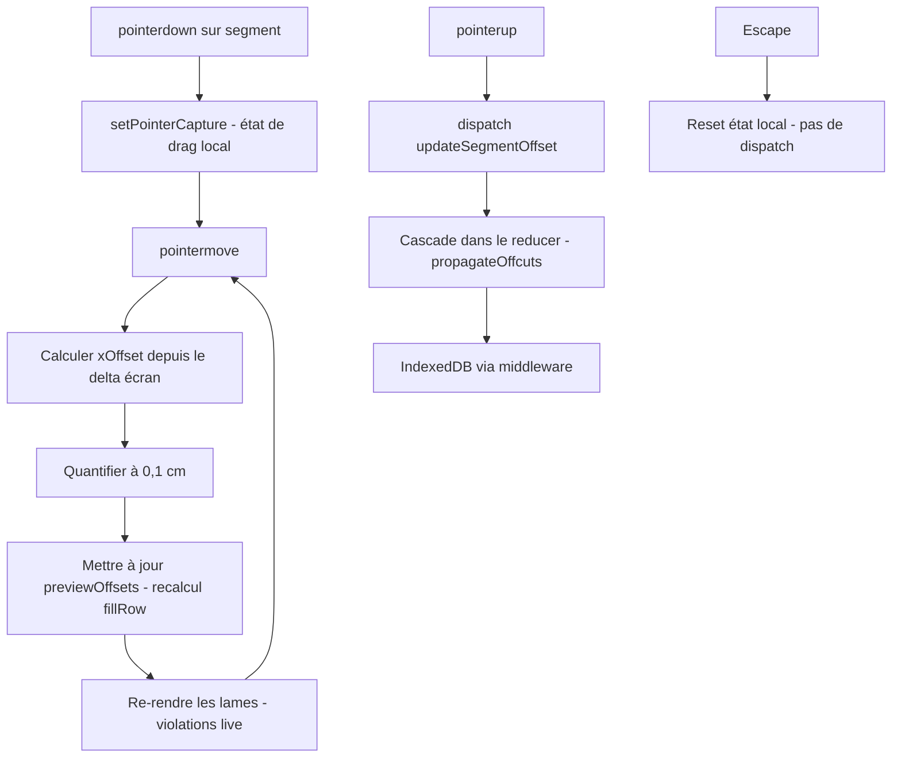

# Glisser-déposer des rangées

Disponible uniquement en mode **Lames** (`edit`) **et sur la pièce active**. L'utilisateur ajuste le décalage du motif d'un segment en le glissant horizontalement.

## Calcul du déplacement

Glisser à droite déplace les joints vers la droite, ce qui correspond à une **diminution** de `xOffset` :

```
xOffset = offsetInitial − (clientXCourant − clientXDépart) / zoom
```

Le déplacement est converti de l'espace écran vers l'espace monde en divisant par le niveau de zoom, garantissant un comportement cohérent quelle que soit l'échelle.

La valeur est quantifiée au **0,1 cm** (cohérent avec la règle d'arrondi globale) puis bornée à `[0, plankType.length − 0,1]`.

## Flux de drag



## Politique : preview libre + violations visibles (non-bloquant)

Le drag suit le curseur **librement** — aucune position n'est jamais bloquée. Les violations de contraintes (`first-plank-too-short`, `last-plank-too-short`, `row-gap-too-small`) sont **calculées en temps réel** et signalées visuellement pendant le drag (lames en rouge + badge d'alerte). Au relâchement, la valeur courante est **commitée telle quelle**, même si elle produit une rangée invalide — c'est cohérent avec la politique « jamais de blocage UX, toujours un feedback visible ».

## Preview en temps réel

Pendant le drag, les lames se repositionnent à chaque événement **sans toucher au store**. L'état `previewOffsets` est porté localement par le composant `<Row>` ; `fillRow` est recalculé à la volée pour le segment dragué uniquement. Ce n'est qu'au relâchement que `updateSegmentOffset` est dispatché et persisté dans IndexedDB.

## Annotations figées pendant le drag

Les **textes de mesure** (longueur de la première et de la dernière lame coupée) **restent figés sur les valeurs committées** pendant toute la durée du drag. Cela évite un défilement rapide de chiffres peu lisibles pendant le mouvement. Les valeurs reprennent leur vraie valeur courante au relâchement.

## Retour visuel

Pendant le drag : le segment passe à **70 % d'opacité** et ses contours basculent vers la couleur d'accent (`--accent`). Le curseur bascule `grab` → `grabbing`.

## Annulation

Appuyer sur **Échap** pendant le drag annule l'action : pas de dispatch, pas de mise à jour du store, restauration immédiate de l'état visuel. Un `pointercancel` système produit le même comportement.

## Cascade au relâchement

La cascade est déclenchée **dans le même reducer** que `updateSegmentOffset` (via `propagateOffcuts`), donc en un seul dispatch et un seul re-render.

**Règles :**
- Ne s'applique qu'au drag de `segments[0]`. Les segments d'index > 0 (portions intérieures d'une pièce concave) ne produisent pas la chute « fin de rangée » utilisée par les rangées suivantes — leur drag n'entraîne pas de cascade.
- Ne concerne que les rangées **postérieures** du **même `plankTypeId`** dans la **même pièce**. Les rangées d'un autre type ou d'une autre pièce restent inchangées.
- Si la rangée dragué n'a pas de chute exploitable, les rangées suivantes retombent à `xOffset = 0`.
- Chaque rangée recalcule son `xOffset` via `computeDefaultXOffset` et hérite donc du **bornage par `minPlankLength`** (voir [row-fill.md](row-fill.md)) : la cascade ne propage pas de violations évitables. En revanche, le segment **explicitement dragué** par l'utilisateur reste permissif — une violation délibérée reste visible.

## Édition inline alternative

Le drag souris est limité par la résolution écran et le zoom. Pour un ajustement précis au mm près, l'utilisateur peut **double-cliquer** sur l'annotation chiffrée d'une première ou dernière planche et taper la longueur souhaitée :

- **Double-clic** sur le texte d'annotation → l'annotation devient un input éditable, valeur sélectionnée.
- **Blur** (clic ailleurs) ou **Entrée** → commit. La longueur est convertie en `xOffset` via `xOffsetFromFirstLength` (formule directe `xOffset = L − f`) ou `xOffsetFromLastLength` (recherche par simulation pas 0,1 cm). La cascade `propagateOffcuts` se déclenche comme pour le drag.
- **Échap** → annule.
- Hors mode `edit`, l'annotation reste en lecture seule.

Les annotations sont **toujours visibles** sur la première et la dernière planche d'un segment (même quand pleines), pour rester un point d'entrée d'édition fiable.

Voir aussi [row-fill.md](row-fill.md) pour l'algorithme de remplissage et [constraints-annotations.md](constraints-annotations.md) pour les indicateurs visuels pendant le drag.
