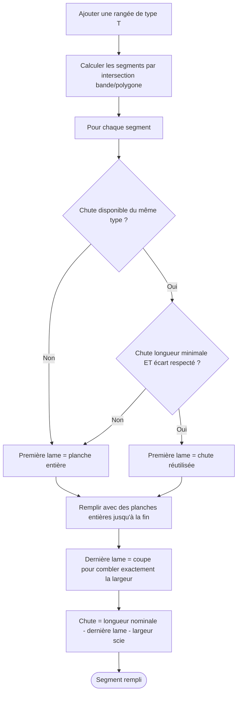

# Remplissage automatique des rangées

Le remplissage se déclenche dès qu'une rangée est ajoutée en mode **Modifier** (`edit`). L'algorithme calcule les segments de la rangée par intersection avec le polygone de la pièce, puis positionne les lames dans chaque segment.

## Postulat de base

Les rangées sont des strips **horizontaux** (hauteur constante = largeur du type de lame). Une pose en diagonale ou en chevrons nécessiterait une révision complète de l'algorithme — hors scope.

## Calcul des segments par rangée

Chaque rangée occupe une bande `[yStart, yEnd]` avec :

- `yStart = roomMinY + cale + rowIndex × plankType.width`
- `yEnd = yStart + plankType.width`

Le décalage initial de `cale` réserve la zone de dilatation en **haut** de la pièce ; un décalage symétrique en bas est matérialisé visuellement par les strips `--plank-cale`.

La bande est intersectée avec le polygone via `intersectStripExtents` (`src/core/geometry.ts`) :

1. Partitionnement par **scanline au milieu** (`yMid`) — détermine le nombre de segments disjoints.
2. Échantillonnage supplémentaire en `y1`, `y2` et à chaque `vertex.y` strictement inclus dans la bande.
3. Pour chaque segment de base, fusion avec les échantillons qui le chevauchent horizontalement → `xStart = min`, `xEnd = max` sur toute la hauteur de la bande.

Conséquence : dans un coin type "L inversé" avec un mur diagonal, la rangée s'étend jusqu'au **X minimum atteint** sur la hauteur de la bande. Les lames sont comptées comme **entières** (pour la matière), tout en étant **clippées visuellement** au polygone via un `<clipPath>` SVG (les planches seraient physiquement coupées dans leur longueur pour épouser le coin).

Une pièce concave (en L, en U…) peut produire **plusieurs segments** pour une même rangée. Chaque segment est rempli indépendamment.

```
Exemple — pièce en U :

  +-------+   +-------+
  |       |   |       |
  | seg 0 |   | seg 1 |
  |       |   |       |
  +-------+---+-------+
  |                   |
  |      seg 0        |
  |                   |
  +-------------------+

Rangée haute : 2 segments
Rangée basse : 1 segment
```

Les coupes aux murs diagonaux sont toujours perpendiculaires (coupe droite). Longueur utile = longueur du segment dans la pièce. Chute = longueur brute − longueur utile.

## Algorithme de remplissage par segment



## Contrainte esthétique inter-rangées

Un segment de la rangée N "touche" un segment de la rangée N−1 s'ils se chevauchent horizontalement. Pour chaque paire qui se touche, on calcule l'intervalle d'offsets X qui violerait la contrainte esthétique (écart min entre fins de rangées). On agrège tous ces intervalles → ensemble de zones interdites.

À l'ajout d'une rangée, le positionnement automatique cherche un offset hors de ces zones. Si impossible (certaines configurations l'imposent), la violation est acceptée et signalée visuellement — l'utilisateur n'est pas bloqué.

## Ce qui est stocké vs recalculé

La géométrie des segments (xStart, xEnd, y1, y2) n'est **jamais stockée**. Seul l'`xOffset` de chaque segment est persisté. À chaque rendu, la géométrie est recalculée — c'est une **fonction pure déterministe**.

```typescript
// Seules données persistées
interface Row {
  id: string
  roomId: string
  plankTypeId: string
  segments: { xOffset: number }[]  // un par segment — tout le reste est recalculé
}
```

Toutes les valeurs numériques sont exprimées en centimètres, arrondies au 0,1 cm le plus proche.

## Réutilisation des chutes

L'algorithme cherche, parmi les chutes disponibles du même type de lame, la plus grande dont la longueur est inférieure ou égale à la largeur disponible. Il vérifie ensuite que cette réutilisation respecte les contraintes de longueur minimale et d'écart esthétique. Si aucune chute ne satisfait ces critères, le segment démarre avec une planche neuve entière.

### Valeur par défaut à l'ajout d'une rangée

`addRow(room, plankType, poseParams)` (dans `src/core/addRow.ts`) fixe le `xOffset` initial du segment 0 en consommant la chute de la rangée précédente du **même type de lame** dans la pièce :

```
prev     = dernière row de la pièce avec plankTypeId identique (s'il en existe)
offcut   = computeOffcutLength(prev.segments[0].xOffset, roomWidth, plankType, poseParams)
xOffset₀ = offcut > 0 ? plankType.length - offcut : 0
```

`computeOffcutLinks` (selector `selectOffcutLinks`) matérialisera le lien `sourceRowId → targetRowId` au rendu : annotation blanche = chute réutilisée, annotation rouge (`--danger`) = chute non consommée.

Voir aussi [row-drag.md](row-drag.md) pour le comportement pendant le glisser-déposer.
