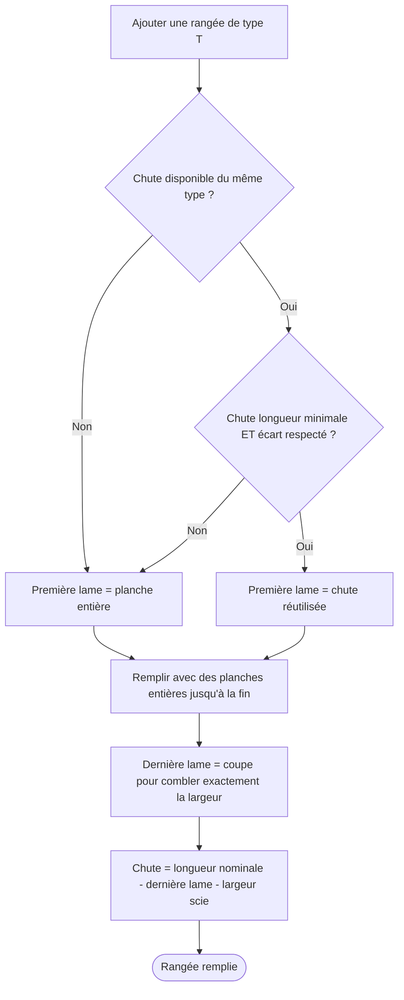

# Remplissage automatique des rangées

Le remplissage se déclenche dès qu'une rangée est ajoutée en mode **Lames**. L'algorithme calcule la séquence de lames qui couvre la largeur disponible (largeur de la pièce moins deux fois la cale de dilatation).

## Algorithme



## Réutilisation des chutes

L'algorithme cherche, parmi les chutes disponibles du même type de lame, la plus grande dont la longueur est inférieure ou égale à la largeur disponible. Il vérifie ensuite que cette réutilisation respecte les contraintes de longueur minimale et d'écart esthétique. Si aucune chute ne satisfait ces critères, la rangée démarre avec une planche neuve entière.

## Ce qui est stocké vs recalculé

Les `Plank[]` ne sont **jamais stockés** dans IndexedDB. Seul `xOffset` est persisté dans `Row`. À chaque rendu, l'algorithme est rappelé — c'est une **fonction pure déterministe**.

```typescript
// Seule donnée persistée
interface Row {
  id: string
  plankTypeId: string
  xOffset: number  // décalage en cm — tout le reste est recalculé
  yOffset?: number
}
```

Les liens de réutilisation entre rangées sont inférés à l'affichage en comparant les `xOffset` des rangées du même type.

## Cascade

Au relâchement d'un drag, toutes les rangées suivantes du même type dans la même pièce sont recalculées en cascade — leurs `xOffset` sont dérivés de la chute de la rangée précédente.

Voir aussi [row-drag.md](row-drag.md) pour le comportement pendant le glisser-déposer.
