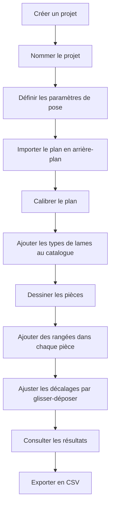
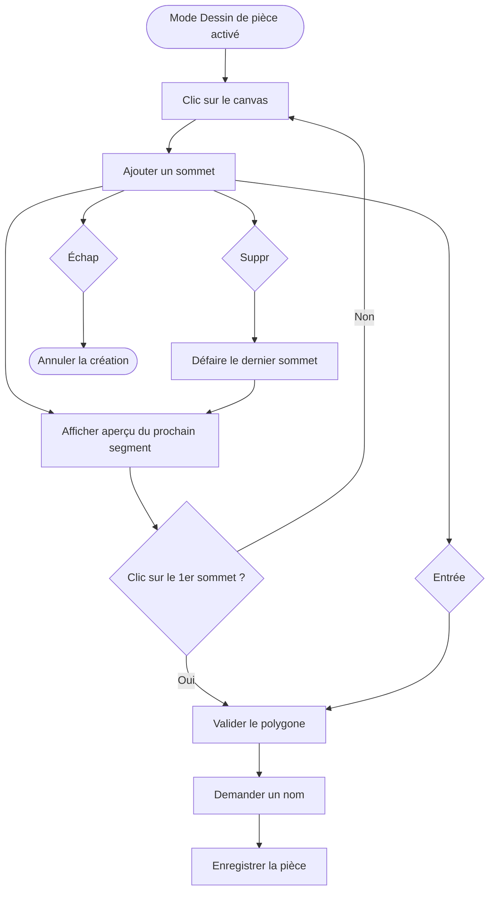
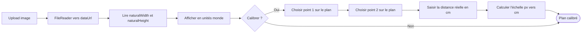
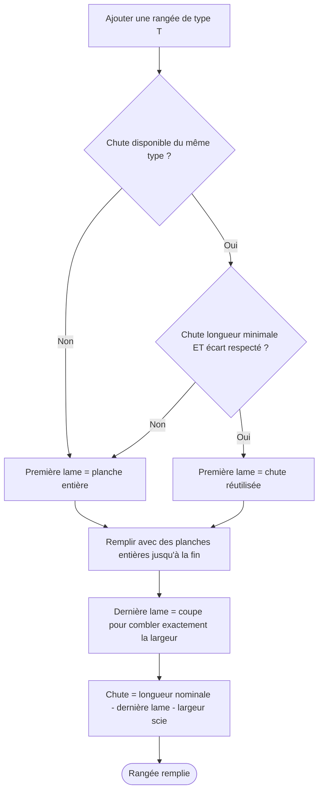
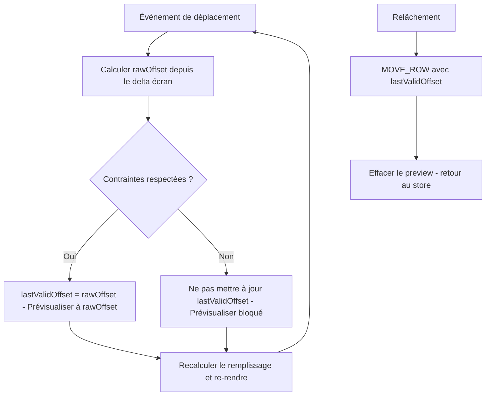
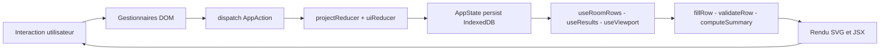
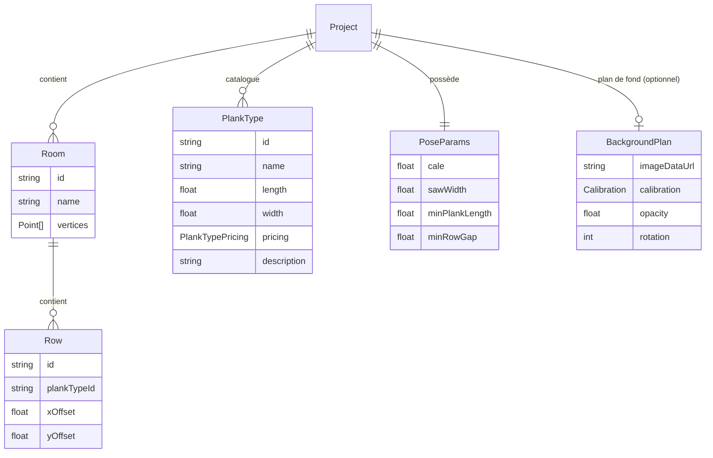

# Calepinage — Documentation

## 1. Vue d'ensemble

**Calepinage** est une application web de calcul de pose de parquet flottant. Elle s'adresse à toute personne souhaitant planifier une pose rectiligne : particulier bricoleur, artisan ou décorateur.

L'objectif principal est double :

1. **Visualiser** la disposition des lames dans chaque pièce, en dessinant les contours à main levée sur un plan importé.
2. **Optimiser les coûts** en calculant automatiquement la réutilisation des chutes entre rangées et entre pièces, afin de minimiser les achats et les pertes matière.

L'application est entièrement front-end, sans serveur, et fonctionne hors-ligne après le premier chargement. Toutes les données sont stockées localement dans le navigateur via IndexedDB. Il n'y a aucun compte utilisateur, aucune synchronisation cloud : tout reste sur la machine de l'utilisateur.

L'espace de travail se compose de trois zones fonctionnelles :

- **La zone SVG centrale** : le canvas interactif où s'affichent le plan importé, les pièces dessinées et les lames calculées. C'est ici que l'utilisateur dessine, navigue et ajuste les rangées.
- **Les panneaux latéraux** : paramètres du projet, catalogue de types de lames, paramètres de pose, résultats et export.
- **La barre d'outils** : bascule entre les modes d'interaction, sélecteur de pièce active et ajout de rangées.

---

## 2. Scénario utilisateur classique

Le parcours typique d'un utilisateur suit cette séquence :



### 2.1 Créer et configurer un projet

Au lancement, l'utilisateur crée un nouveau projet et lui donne un nom. Plusieurs projets peuvent coexister — par exemple un par logement en rénovation, ou plusieurs variantes de revêtement pour un même espace. On bascule de l'un à l'autre via le panneau projet.

Une fois le projet créé, il définit les **paramètres de pose** qui s'appliquent à toutes les pièces du projet :

| Paramètre | Description | Défaut |
| --- | --- | --- |
| Cale de dilatation | Espace laissé entre les lames et chaque mur. La longueur d'une rangée = largeur de la pièce − 2 × cale. | 0,5 cm |
| Largeur de la lame de scie | Épaisseur de l'outil de découpe, déduite de la longueur brute d'une chute pour obtenir sa longueur utilisable. | 0,1 cm |
| Longueur minimale de lame | En dessous de cette valeur, une lame en début ou fin de rangée est considérée invalide. | 30 cm |
| Écart minimal entre fins de rangées | Contrainte esthétique : deux rangées consécutives du même type ne doivent pas se terminer trop proches l'une de l'autre. | 15 cm |

Ces paramètres influencent directement les calculs de remplissage et les indicateurs d'erreur. Ils peuvent être ajustés à tout moment ; les résultats se recalculent immédiatement.

### 2.2 Importer et calibrer le plan

L'utilisateur importe une image via le mode **Plan** de la barre d'outils. L'image s'affiche en arrière-plan du canvas et sert de guide pour le dessin des pièces. La procédure de calibration et les options disponibles en mode Plan sont détaillées en sections 3.3 et 4.2.

### 2.3 Définir le catalogue de lames

Avant de dessiner les pièces, l'utilisateur constitue son catalogue : les types de lames qu'il envisage d'utiliser. Chaque type est défini par ses dimensions (longueur × largeur en cm), son tarif (à l'unité ou au lot), et une description libre qui peut contenir une URL fournisseur, un code référence, ou toute note utile.

Exemple de catalogue pour une pose à la française :

- **Chêne naturel 120×14 cm** — vendu par lot de 8, 45 €/lot
- **Chêne naturel 120×10 cm** — vendu à l'unité, 6 €/pièce

L'utilisateur peut réutiliser des types de lames définis dans d'autres projets ; les suggestions sont dédupliquées automatiquement.

### 2.4 Dessiner les pièces

En mode **Dessin de pièce**, l'utilisateur trace le contour de chaque pièce en cliquant successivement sur les angles. Chaque segment est automatiquement contraint à 90°. Quand la pièce est fermée, l'application demande un nom. La procédure est détaillée en section 4.1.

### 2.5 Ajouter et ajuster les rangées

En mode **Lames**, après avoir sélectionné une pièce, l'utilisateur ajoute des rangées une par une en choisissant le type de lame. L'application remplit automatiquement chaque rangée en respectant les contraintes et en réutilisant les chutes disponibles. L'utilisateur peut affiner la disposition en glissant chaque rangée horizontalement. Voir sections 4.3 et 4.4.

### 2.6 Consulter et exporter les résultats

Le panneau **Résultats** affiche en permanence le récapitulatif des achats par type de lame et la liste des liens de réutilisation entre chutes. Un bouton permet d'exporter ces deux tableaux en CSV.

---

## 3. Modes d'interaction

La barre d'outils expose quatre modes exclusifs. Le mode actif détermine le comportement du canvas et les éléments visuels affichés. La navigation dans le canvas (zoom, pan) reste disponible en permanence quel que soit le mode actif — voir section 4.7.

| `InteractionMode` | Label barre d'outils | Icône suggérée | Description |
| --- | --- | --- | --- |
| `nav` | **Navigation** | `MousePointer` 🖱️ | Mode par défaut — pan, zoom, sélection de pièce |
| `add-room` | **Dessin de pièce** | `PenLine` ✏️ | Tracé interactif d'un polygone à angles droits |
| `edit-plan` | **Plan** | `Image` 🖼️ | Gestion du plan de fond : import, calibration, opacité |
| `edit-rows` | **Lames** | `Layers` ▦ | Ajustement des rangées de la pièce active |

### 3.1 Navigation — comportement de base

Le mode Navigation est le mode par défaut, actif au lancement et accessible depuis n'importe quel autre mode.

**Ce qui est affiché :**
- Toutes les pièces, à opacité normale
- Les rangées de la pièce active (lames visibles, sans annotations)
- Aucun outil de dessin actif

**Interactions spécifiques :**
- Clic sur une pièce → la sélectionner comme pièce active
- Clic gauche + glisser → pan du canvas

### 3.2 Dessin de pièce — différences par rapport à Navigation

**Ce qui change :**
- Le curseur devient une croix (`crosshair`)
- Clic gauche → place un sommet (ne pan plus)
- Un aperçu en temps réel montre le prochain segment entre le dernier sommet validé et la position du curseur
- Raccourcis clavier : `Suppr` (défaire), `Échap` (annuler), `Entrée` (valider)

**Ce qui reste inchangé :** toutes les pièces existantes restent visibles ; pan disponible via le bouton milieu de la souris.

### 3.3 Plan — différences par rapport à Navigation

**Ce qui change :**
- Un panneau flottant apparaît avec les contrôles du plan de fond : import d'image, calibration, rotation (±90°) et **opacité**
- Un **slider d'opacité** permet d'ajuster la transparence du plan entre 0 % (invisible) et 100 % (plein), afin de distinguer le plan des pièces dessinées par-dessus ; la valeur est persistée dans le projet
- Si la calibration est en cours, le curseur devient `crosshair` et les clics posent les points de référence
- Les pièces sont légèrement atténuées (`opacity: 0.3`) pour mettre le plan en valeur

**Ce qui reste inchangé :** pan et zoom disponibles normalement.

### 3.4 Lames — différences par rapport à Navigation

**Ce qui change :**
- La **pièce active** est affichée normalement avec ses rangées et ses **annotations** de liens de réutilisation (voir section 4.6)
- Toutes les **autres pièces** sont atténuées (`opacity: 0.2`) pour mettre la pièce active en avant
- Les rangées de la pièce active sont **draggables** (curseur `grab` → `grabbing` pendant le drag)
- Le sélecteur de pièce active dans la barre d'outils permet de changer de pièce sans quitter le mode Lames
- `Échap` → retour au mode Navigation

**Ce qui reste inchangé :** pan et zoom disponibles normalement.

---

## 4. Détail des fonctionnalités

### 4.1 Dessin de pièces

L'utilisateur pose des sommets un par un en mode **Dessin de pièce**. Chaque nouveau sommet est contraint à partager sa coordonnée X ou Y avec le sommet précédent pour garantir les angles droits. Pendant la saisie, un aperçu en temps réel montre le segment en cours entre le dernier sommet validé et la position du curseur.



**Snap à 90°** : à chaque déplacement de la souris, l'application compare le delta horizontal et le delta vertical depuis le dernier sommet. L'axe avec le plus grand delta l'emporte — le point prévisualisé est alors aligné sur l'autre coordonnée du point précédent. Ce comportement est automatique et transparent pour l'utilisateur.

**Raccourcis clavier :**
- `Suppr` — annule le dernier sommet placé
- `Échap` — abandonne entièrement la pièce en cours, sans rien enregistrer
- `Entrée` — valide la pièce avec les sommets actuels et ouvre la saisie du nom

**Pièce non terminée** : si l'utilisateur change de mode sans appuyer sur Entrée, les sommets en cours sont purement abandonnés. Aucune pièce partielle n'est enregistrée dans IndexedDB.

### 4.2 Plan en arrière-plan

Le plan joue un rôle de guide passif : l'utilisateur s'en sert pour tracer les pièces avec précision, mais il n'est ni analysé ni interprété par l'application.

L'image est affichée comme élément `<image>` SVG et dimensionnée en **unités monde** (centimètres). Cette décision garantit que le plan participe naturellement au zoom et au pan du canvas. Les dimensions sont calculées au chargement en lisant `naturalWidth` et `naturalHeight` de l'image, puis en appliquant l'échelle de calibration.



La calibration peut être refaite à tout moment sans perdre les pièces déjà dessinées : elles sont définies en coordonnées monde et s'adaptent automatiquement à la nouvelle échelle. La rotation est non destructive : elle s'applique par transformation sans modifier les données stockées.

**Opacité** : le slider disponible en mode Plan permet de doser la visibilité du plan entre 0 % et 100 %. La valeur est persistée dans `BackgroundPlan.opacity`.

**Sans calibration** : l'échelle par défaut est 1 px = 1 cm. Le plan s'affiche et l'utilisateur peut dessiner des pièces, mais les dimensions calculées seront incorrectes.

**Technique de contraste pour les annotations** : toutes les annotations textuelles utilisent du texte blanc avec un contour coloré rendu en premier (`paintOrder: stroke`). Le contour crée un halo garantissant la lisibilité quelle que soit l'image sous-jacente, sans fond de bulle opaque :

```
fill        = "white"
stroke      = "black" | "#dc2626"   /* noir si lien identifié, rouge si perte potentielle */
strokeWidth = 2.5 / zoom            /* constant en pixels écran, quel que soit le zoom     */
paintOrder  = "stroke"              /* contour dessiné avant le texte                      */
```

### 4.3 Remplissage automatique des rangées

Le remplissage se déclenche dès qu'une rangée est ajoutée en mode **Lames**. L'algorithme calcule la séquence de lames qui couvre la largeur disponible (largeur de la pièce moins deux fois la cale de dilatation).



**Algorithme de réutilisation** : l'algorithme cherche, parmi les chutes disponibles du même type de lame, la plus grande dont la longueur est inférieure ou égale à la chute disponible. Il vérifie ensuite que cette réutilisation respecte les contraintes de longueur minimale et d'écart esthétique. Si aucune chute ne satisfait ces critères, la rangée démarre avec une planche neuve entière.

**Dérivation depuis `xOffset`** : les `Plank[]` ne sont jamais stockés dans IndexedDB. Seul `xOffset` est persisté dans `Row`. À chaque rendu, l'algorithme est rappelé — c'est une fonction pure déterministe. Les liens de réutilisation entre rangées sont inférés à l'affichage en comparant les `xOffset` des rangées du même type.

### 4.4 Glisser-déposer des rangées

Disponible uniquement en mode **Lames**. L'utilisateur ajuste le décalage du motif d'une rangée en la glissant horizontalement.

**Direction** : glisser à droite déplace les joints vers la droite, ce qui correspond à une diminution de `xOffset` :

```
xOffset = offsetInitial − (positionCouranteSouris − positionDépart) / zoom
```

Le déplacement est converti de l'espace écran vers l'espace monde en divisant par le niveau de zoom, garantissant un comportement cohérent quelle que soit l'échelle.

**Preview en temps réel** : pendant le drag, les lames se repositionnent à chaque événement sans toucher au store. Ce n'est qu'au relâchement que l'action `MOVE_ROW` est dispatchée et persistée dans IndexedDB.

**Blocage dur sur positions invalides** : à chaque position candidate, les contraintes sont vérifiées. Si la position est invalide, le dernier offset valide (`lastValidOffset`) n'est pas mis à jour et les lames restent bloquées visuellement, même si le curseur continue d'avancer. Au relâchement, `lastValidOffset` est toujours commité — jamais une position invalide.



**Retour visuel pendant le drag** : la rangée passe à 70 % d'opacité et ses contours basculent vers la couleur d'accent.

**Cascade** : au relâchement, toutes les rangées suivantes du même type dans la même pièce sont recalculées en cascade — leurs `xOffset` sont dérivés de la chute de la rangée précédente.

### 4.5 Indicateurs visuels de contraintes

Les trois contraintes vérifiées à chaque rendu et pendant le drag :

| Contrainte | Condition |
| --- | --- |
| `first-plank-too-short` | La première lame visible est inférieure à `minPlankLength` |
| `last-plank-too-short` | La dernière lame est inférieure à `minPlankLength` |
| `row-gap-too-small` | L'écart entre la fin de cette rangée et la fin de la rangée précédente du même type est inférieur à `minRowGap` |

Chaque lame dont la longueur est inférieure à `minPlankLength` reçoit un fond et un contour d'erreur :

```css
fill:   var(--error-bg)   /* rgba(220, 38, 38, 0.35) */
stroke: var(--error)      /* #dc2626                  */
```

Ces indicateurs se mettent à jour en temps réel pendant le drag et lors de la modification des paramètres de pose.

### 4.6 Annotations de liens de réutilisation

Visibles uniquement en mode **Lames**. À chaque extrémité d'une rangée, une annotation textuelle indique la longueur de la pièce partielle et, le cas échéant, son lien avec une autre rangée.

Les annotations sont positionnées **à l'extérieur de la zone des lames** — à gauche du bord gauche pour le début de rangée, à droite du bord droit pour la fin — afin de ne jamais masquer les lames.

**Règles d'affichage :**

- **Début de rangée** : annotation affichée uniquement si la première lame est plus courte que la longueur nominale (c'est-à-dire si `xOffset > 0`). Si la rangée commence avec une planche entière (`xOffset = 0`), aucune annotation n'est affichée.
- **Fin de rangée** : annotation affichée uniquement si la dernière lame est plus courte que la longueur nominale (une coupe a été faite et une chute a été générée). Si la dernière lame remplit exactement l'espace sans coupe, aucune annotation n'est affichée.

| Cas | Position | Exemple | Couleur contour |
| --- | --- | --- | --- |
| Début — planche coupée sur planche neuve | Gauche | `+ 47 cm` | Rouge |
| Début — chute réutilisée en entrée | Gauche | `+ 34,5 cm (rangée 2, dernière planche)` | Noir |
| Fin — chute non réutilisée (perte) | Droite | `+ 12 cm` | Rouge |
| Fin — chute réutilisée dans une rangée suivante | Droite | `+ 34,5 cm (rangée 4, première planche)` | Noir |

Le rouge indique une **perte matière potentielle** dans la configuration actuelle : aucune autre rangée ne consomme cette pièce. Un ajustement des décalages peut parfois créer un lien là où il n'en existait pas.

La technique de contraste utilisée est décrite en section 4.2.

### 4.7 Navigation dans le canvas

La navigation est disponible en permanence, quel que soit le mode actif.

| Action | Geste |
| --- | --- |
| Zoom centré sur la souris | `Ctrl + molette` |
| Pan libre | Clic gauche + glisser (mode Navigation), ou bouton milieu partout |
| Pan au clavier | `Ctrl + ↑ ↓ ← →` |
| Défilement vertical | Molette seule |
| Défilement horizontal | `Shift + molette` |

Le zoom est intercepté via un écouteur `wheel` natif enregistré avec `{ passive: false }`. Ce détail est important : les écouteurs React sont enregistrés en mode passif par défaut, ce qui empêche d'appeler `preventDefault()` et laisse le navigateur zoomer la page entière sur `Ctrl + molette`. L'écouteur natif contourne cette limitation en interceptant l'événement avant qu'il ne remonte au navigateur.

### 4.8 Gestion de projets et reprise de session

L'utilisateur peut maintenir plusieurs projets en parallèle. La création, la sélection et la suppression d'un projet se font depuis le panneau projet. Toute suppression portant sur des éléments comportant des enfants (projet avec pièces et rangées, pièce avec rangées) est protégée par une **confirmation explicite**.

**Reprise de session** : au retour dans l'application, l'utilisateur retrouve automatiquement le dernier projet sur lequel il travaillait.

Une fonctionnalité envisagée est le **clonage partiel ou complet** d'un projet : l'utilisateur pourrait choisir les éléments à dupliquer parmi le catalogue, les paramètres de pose, les pièces et le plan de fond.

---

## 5. Contraintes techniques

### 5.1 Stack et déploiement

```
React 19 + TypeScript + Vite → build statique → GitHub Pages
Persistance : IndexedDB via wrapper natif (sans librairie tierce)
Aucun backend, aucune dépendance réseau après le premier chargement
```

**Déploiement continu** : un workflow GitHub Actions déclenché à chaque push sur la branche principale exécute le build TypeScript + Vite et déploie le résultat sur GitHub Pages.

**Mode hors-ligne** : un Service Worker met en cache les assets au premier chargement, permettant à l'application de fonctionner intégralement sans connexion lors des visites suivantes.

### 5.2 Séparation des responsabilités

L'architecture distingue trois niveaux de responsabilités, chacun indépendant du suivant :

**Logique métier** (`src/core/`) : fonctions pures, types de domaine, règles de calcul. Zéro dépendance React, zéro accès au DOM. Ce code peut être extrait, testé en isolation ou porté vers n'importe quel autre environnement (SolidJS, CLI Node, web worker) sans modification.

**Manipulation du DOM** : gestion des événements natifs (`wheel`, `keydown`, `pointermove`…), calculs de coordonnées, transformations géométriques. Cette logique est extraite des composants dans des fonctions ou modules dédiés, sans dépendance aux mécanismes internes de React.

**Interface React** (`src/store/`, `src/hooks/`, `src/components/`) : orchestration de l'état global via `useReducer`, persistance IndexedDB, hooks qui assemblent logique métier et état, composants JSX qui ne font que rendre des données.

```
src/
├── core/        ← logique métier pure — ZÉRO React, ZÉRO DOM
│                   fillRow, validateRow, computeSummary, geometry...
├── store/       ← état global (useReducer) + persistance IndexedDB
│                   projectReducer, uiReducer, db.ts
├── hooks/       ← hooks React + logique DOM extraite
│                   useRoomRows, useViewport, useResults...
└── components/  ← rendu JSX uniquement, aucune logique métier
                    SvgCanvas, Toolbar, panneaux...
```

Le flux de données est strictement unidirectionnel :



### 5.3 Ce qui est stocké vs ce qui est calculé

**Seules les données saisies par l'utilisateur sont stockées.** Tout ce qui peut être dérivé est recalculé à chaque rendu.

**Stocké dans IndexedDB :**

```typescript
interface Row {
  id: string
  plankTypeId: string
  xOffset: number   // seul paramètre de position, en cm
  yOffset?: number  // décalage vertical optionnel (continuité inter-pièces)
}
```

**Jamais stocké, toujours recalculé :**

- `Plank[]` — séquence de lames, recalculée via `fillRow(xOffset, ...)` à chaque rendu
- Liens de réutilisation — inférés à l'affichage en comparant les `xOffset` des rangées du même type
- `ConstraintViolation[]` — recalculées via `validateRow()`
- Résultats financiers — recalculés via `computeSummary()`
- Liens entre chutes — recalculés via `computeOffcutLinks()`

Cette approche élimine les problèmes de désynchronisation entre données stockées et données dérivées.

### 5.4 Modèle de données

Les entités stockées forment un arbre enraciné sur `Project`. IndexedDB stocke les projets comme des objets JSON sérialisés intégralement — pas de base relationnelle.



`PlankType` est référencé depuis `Row` par son `id`. Au rendu, l'algorithme résout cette référence via `project.catalog` pour obtenir les dimensions.

`BackgroundPlan` est positionné sur `Project` (et non sur `Room`) car un seul plan de fond par projet suffit en pratique.

### 5.5 Conventions de code

**Taille des fichiers** : maximum ~150 lignes par fichier. Quand un fichier approche la limite, c'est un signal pour extraire une sous-responsabilité dans un module dédié.

**Ordre des imports** — trois groupes séparés par une ligne vide, chacun trié alphabétiquement :

```typescript
// 1. node_modules
import { useState } from 'react'

// 2. alias de chemin (@/ → src/)
import { fillRow } from '@/core/rowFill'
import type { PoseParams } from '@/core/types'

// 3. chemins relatifs
import { RowDragHandle } from './RowDragHandle'
```

**TypeScript strict** : pas de `any`, unions discriminées narrowées explicitement, types importés avec `import type` quand aucune valeur runtime n'est utilisée.

**CSS custom properties** : toutes les couleurs sont exprimées via des variables CSS définies dans `index.css`. Jamais de valeur hexadécimale en dur dans un composant. Le thème sombre est géré via `@media (prefers-color-scheme: dark)` en surchargeant les mêmes variables.

Variables utilisées dans le canvas SVG :

```css
--accent:      #7c3aed                   /* éléments interactifs, drag actif         */
--error:       #dc2626                   /* lame trop courte, chute perdue (contour) */
--error-bg:    rgba(220, 38, 38, 0.35)   /* lame trop courte (fond semi-transparent) */
--warning:     #d97706                   /* violation de contrainte esthétique        */
--warning-bg:  rgba(217, 119, 6, 0.35)   /* fond d'alerte modéré                     */
--border:      #e5e7eb                   /* contour normal des lames                 */
--bg-surface:  #ffffff                   /* fond normal des lames                    */
--accent-bg:   rgba(124, 58, 237, 0.08)  /* fond de remplissage des pièces           */
```

---

## 6. Glossaire

| Terme | Définition |
| --- | --- |
| **Calepinage** | Planification de la disposition des lames de parquet dans une ou plusieurs pièces, en optimisant la réutilisation des chutes pour minimiser les coûts. |
| **Lame** | Une planche de parquet individuelle, caractérisée par une longueur et une largeur. Synonyme : planche. |
| **Type de lame** | Spécification d'un modèle de lame (dimensions, tarif, description) dans le catalogue du projet. Plusieurs rangées peuvent référencer le même type. |
| **Rangée** | Suite de lames disposées côte à côte, couvrant la pièce sur toute sa largeur disponible. Chaque rangée appartient à une pièce et référence un type de lame. |
| **Chute** | Morceau de lame résultant d'une coupe en fin de rangée. Sa longueur utilisable est la longueur brute moins la largeur de la lame de scie. Elle peut être réutilisée comme première lame d'une rangée suivante du même type. |
| **Perte matière** | Chute qui n'est réutilisée dans aucune autre rangée. Signalée par une annotation rouge. |
| **xOffset** | Décalage horizontal du motif d'une rangée, en centimètres. Représente la longueur de la portion de planche entière qui se trouverait théoriquement à gauche du mur. `xOffset = 0` signifie que la rangée commence avec une planche neuve entière. |
| **yOffset** | Décalage vertical optionnel d'une rangée par rapport à sa position calculée automatiquement. Permet d'assurer une continuité visuelle avec une pièce adjacente. |
| **Cale de dilatation** | Espace (en cm) laissé entre les lames et les murs pour permettre la dilatation thermique. Appliqué des deux côtés : `largeur disponible = largeur pièce − 2 × cale`. |
| **Largeur de la lame de scie** | Épaisseur de l'outil de découpe (en cm), déduite de la longueur brute d'une chute pour obtenir sa longueur utilisable. |
| **Pose rectiligne** | Mode de pose où toutes les rangées sont parallèles entre elles, par opposition à la pose en diagonale ou en chevrons. |
| **Pièce active** | La pièce sélectionnée dans la barre d'outils, sur laquelle portent les opérations en cours (ajout de rangées, drag, affichage des annotations). |
| **Annotation** | Texte affiché à l'extérieur des lames (à gauche ou à droite) indiquant la longueur d'une pièce partielle et son lien éventuel de réutilisation. Visible uniquement en mode Lames. |
| **Plan de fond** | Image importée par l'utilisateur et affichée en arrière-plan du canvas SVG comme guide de dessin des pièces. |
| **Calibration** | Opération consistant à indiquer la distance réelle (en cm) entre deux points identifiables du plan de fond, permettant à l'application de calculer l'échelle pixels → centimètres. |
| **Unités monde** | Système de coordonnées en centimètres dans lequel sont exprimées les positions des pièces, des lames et du plan de fond. Distinct des coordonnées pixels de l'écran, converties via le viewport (pan + zoom). |
| **Viewport** | Fenêtre de visualisation définie par un niveau de zoom et un décalage de pan. Permet de convertir des coordonnées écran en unités monde et inversement. |
