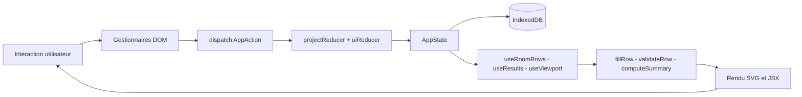

# Architecture

## Stack et déploiement

```
React 19 + TypeScript (strict) + Vite → build statique → GitHub Pages
Persistance : IndexedDB via wrapper natif (sans librairie tierce)
Package manager : Bun
Tests : Vitest + @amiceli/vitest-cucumber
Aucun backend, aucune dépendance réseau après le premier chargement
```

**Déploiement continu** : workflow GitHub Actions déclenché à chaque push sur `main` — build TypeScript + Vite, déploiement GitHub Pages, création d'un tag versionné.

**Mode hors-ligne** : un Service Worker met en cache les assets au premier chargement.

## Séparation des responsabilités

L'architecture distingue trois niveaux indépendants :

**Logique métier** (`src/core/`) : fonctions pures, types de domaine, règles de calcul. Zéro dépendance React, zéro accès au DOM. Ce code peut être extrait, testé en isolation ou porté vers n'importe quel autre environnement sans modification.

**Store / event sourcing** (`src/store/`) : reducer pur, types d'actions, état global, persistance IndexedDB. **Zéro dépendance React.** Ce niveau ne connaît pas `useReducer` ni aucun hook — il expose uniquement des fonctions pures (`projectReducer`, `uiReducer`) et la couche d'accès IndexedDB (`db.ts`). Il pourrait être branché sur n'importe quel autre framework ou environnement.

**Manipulation du DOM** : gestion des événements natifs (`wheel`, `keydown`, `pointermove`…), calculs de coordonnées, transformations géométriques. Extraite des composants dans des fonctions ou modules dédiés, sans dépendance aux mécanismes internes de React.

**Binding React** (`src/hooks/`, `src/components/`) : les hooks font le pont entre le store et React — ils instancient `useReducer` avec les reducers du store, gèrent la persistance IndexedDB, et assemblent logique métier et état. Les composants JSX ne font que rendre des données.

```
src/
├── core/        ← logique métier pure — ZÉRO React, ZÉRO DOM
│                   fillRow, validateRow, computeSummary, geometry...
├── store/       ← reducer, actions, état, IndexedDB — ZÉRO React
│                   projectReducer, uiReducer, db.ts
├── hooks/       ← binding React : useReducer + store, logique DOM
│                   useRoomRows, useViewport, useResults...
└── components/  ← rendu JSX uniquement, aucune logique métier
                    SvgCanvas, Toolbar, panneaux...
```

## Flux de données

Le flux est strictement **unidirectionnel** :


