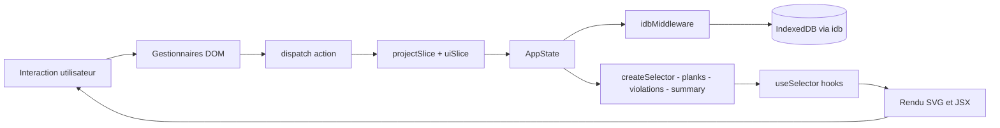

# Architecture

## Stack et déploiement

```
React 19 + TypeScript (strict) + Vite → build statique → GitHub Pages
State management : Redux Toolkit (@reduxjs/toolkit) + react-redux
Persistance : IndexedDB via librairie idb (schéma typé DBSchema)
Package manager : Bun
Tests : Vitest + @amiceli/vitest-cucumber — coverage via Istanbul
Aucun backend, aucune dépendance réseau après le premier chargement
```

**Déploiement continu** : workflow GitHub Actions déclenché à chaque push sur `main` — build TypeScript + Vite, déploiement GitHub Pages, création d'un tag versionné.

**Mode hors-ligne** : un Service Worker met en cache les assets au premier chargement.

## Séparation des responsabilités

L'architecture distingue trois niveaux indépendants :

**Logique métier** (`src/core/`) : fonctions pures, types de domaine, règles de calcul. Zéro dépendance React, zéro accès au DOM. Ce code peut être extrait, testé en isolation ou porté vers n'importe quel autre environnement sans modification.

**Store** (`src/store/`) : slices RTK, état global, persistance IndexedDB, selectors mémoïsés. **Zéro dépendance React.** Basé sur Redux Toolkit (`@reduxjs/toolkit`) : `projectSlice` (Immer) pour les données persistantes, `uiSlice` pour l'état transient (viewport, mode, pièce active). Un middleware dédié (`idbMiddleware`) synchronise IndexedDB après les actions projet. Les selectors (`createSelector` de RTK) mémoïsent les calculs dérivés coûteux (`fillRow`, `computeSummary`…).

Le store est initialisé de façon asynchrone via `createAppStore()` : la liste et le projet courant sont chargés depuis IndexedDB **avant** la création du store, passés en `preloadedState`. Aucune action d'initialisation n'est nécessaire.

**Manipulation du DOM** : gestion des événements natifs (`wheel`, `keydown`, `pointermove`…), calculs de coordonnées, transformations géométriques. Extraite des composants dans des fonctions ou modules dédiés, sans dépendance aux mécanismes internes de React.

**Binding React** (`src/hooks/`, `src/components/`) : les hooks font le pont entre le store Redux et React via `react-redux` (`useSelector`, `useDispatch`). Les composants JSX ne font que rendre des données.

```
src/
├── core/        ← logique métier pure — ZÉRO React, ZÉRO DOM
│                   fillRow, validateRow, computeSummary, geometry...
├── store/       ← slices, selectors, IndexedDB — ZÉRO React
│                   projectSlice, uiSlice, selectors.ts, db.ts
├── hooks/       ← binding React + fonctions pures partagées
│                   viewport.ts (fonctions pures testables)
│                   useViewport.ts (binding Redux)
└── components/
    ├── ui/      ← composants atomiques (Button, Input…)
    └── canvas/  ← composants SVG du canvas
                    Scene/ (racine SVG + grille + useCanvasEvents)
                    Room/ (polygone de pièce)
                    BackgroundPlan/ (image de fond)
```

**Gestion des événements canvas** : les écouteurs sont enregistrés via l'API DOM native dans `useCanvasEvents.ts` (co-localisé dans `Scene/`). L'interception `wheel` avec `{ passive: false }` est indispensable pour appeler `preventDefault()` et empêcher le navigateur de zoomer la page sur Ctrl+molette. Les refs (`viewportRef`, `modeRef`) évitent de ré-enregistrer les écouteurs à chaque changement d'état.

**Tests** : Vitest détecte maintenant deux patterns : `*.steps.ts` (BDD) et `*.test.ts` (unitaires).

## Flux de données

Le flux est strictement **unidirectionnel** :


