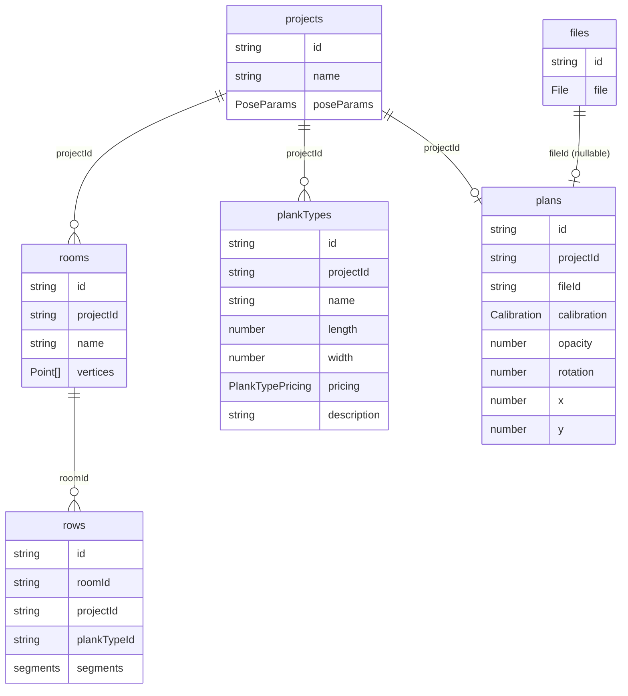

# Modèle de données

## Principe

**Seules les données saisies par l'utilisateur sont stockées.** Tout ce qui peut être dérivé est recalculé à chaque rendu.

## Schéma de stockage IndexedDB

Le stockage est **relationnel** : chaque entité a son propre object store, avec des clés étrangères (FK) explicites. IndexedDB persiste les records via le **Structured Clone Algorithm** — pas de JSON : les types natifs (`File`, `Blob`, `Map`…) sont supportés nativement.

### Object stores

#### `projects`
| Champ | Type | Description |
| --- | --- | --- |
| `id` | `string` | Clé primaire |
| `name` | `string` | Nom du projet |
| `poseParams` | `PoseParams` | Paramètres de pose (1:1, embedded) |

> **Reprise de session** : le dernier projet ouvert est identifié par `localStorage.calepinage.lastProjectId` — pas de champ `lastOpenedAt` dans le modèle. Au boot, l'app charge uniquement le projet courant en entier + la liste minimale `{ id, name }` des autres projets (pour le menu hamburger). Si aucun projet n'existe, un projet vide est créé automatiquement.

#### `rooms`
| Champ | Type | Description |
| --- | --- | --- |
| `id` | `string` | Clé primaire |
| `projectId` | `string` | FK → `projects` |
| `name` | `string` | Nom de la pièce |
| `vertices` | `Point[]` | Sommets du polygone en coordonnées monde (cm) |

#### `rows`
| Champ | Type | Description |
| --- | --- | --- |
| `id` | `string` | Clé primaire |
| `roomId` | `string` | FK → `rooms` |
| `projectId` | `string` | FK → `projects` (dénormalisé pour cleanup — absent du modèle domaine) |
| `plankTypeId` | `string` | FK → `plankTypes` |
| `segments` | `{ xOffset: number }[]` | Un élément par segment géométrique de la rangée (pièces concaves → plusieurs segments). Seul le `xOffset` de chaque segment est persisté ; la géométrie des segments est recalculée à partir des `vertices` de la pièce. |

#### `plankTypes`
| Champ | Type | Description |
| --- | --- | --- |
| `id` | `string` | Clé primaire |
| `projectId` | `string` | FK → `projects` |
| `name` | `string` | Nom du type |
| `length` | `number` | Longueur nominale (cm) |
| `width` | `number` | Largeur (cm) |
| `pricing` | `PlankTypePricing` | Tarif (à l'unité ou au lot) |
| `description` | `string` | Note libre (URL fournisseur, référence…) |

#### `files`
| Champ | Type | Description |
| --- | --- | --- |
| `id` | `string` | Clé primaire |
| `file` | `File` | Fichier image brut (Structured Clone natif) |

#### `plans`
| Champ | Type | Description |
| --- | --- | --- |
| `id` | `string` | Clé primaire |
| `projectId` | `string` | FK → `projects` |
| `fileId` | `string?` | FK nullable → `files` (absent si aucune image importée) |
| `calibration` | `Calibration?` | Points de référence + distance réelle |
| `opacity` | `number` | Opacité 0–1 |
| `rotation` | `number` | Rotation en degrés (0, 90, 180, 270) |
| `x` | `number` | Position horizontale (cm) — repositionnement en mode `plan`, défaut 0 |
| `y` | `number` | Position verticale (cm) — repositionnement en mode `plan`, défaut 0 |

### Diagramme

## Types domaine vs records de stockage

Les **records** (ci-dessus) sont les données brutes stockées dans IndexedDB. Le store layer (`src/store/`) est responsable de les **assembler** en types domaine utilisés par la logique métier (`src/core/`) :

| Type domaine (`src/core/types.ts`) | Assemblé depuis |
| --- | --- |
| `Project` | `projects` + catalog + rooms + backgroundPlan |
| `Room` | `rooms` + ses `rows` |
| `PlankType` | `plankTypes` |
| `BackgroundPlan` | `plans` + `files` (résolution du `File`) |

## Ce qui est recalculé à chaque rendu

| Donnée | Fonction | Source |
| --- | --- | --- |
| `Plank[]` | `fillRow(xOffset, ...)` | `xOffset` + dimensions du type |
| `RowGeometry` | `computeRowGeometry()` + `intersectStripExtents()` | `Room.vertices` + `rowIndex` + `PoseParams` + `PlankType` |
| `OffcutLink[]` | `computeOffcutLinks()` | Comparaison des offcuts par type, à l'échelle projet |
| `ConstraintViolation[]` (inclut `value` mesurée) | `validateRow()` | `Plank[]` de la rangée + `Plank[]` précédente + `PoseParams` |
| Résultats financiers | `computeSummary()` | `Plank[]` + tarifs du catalogue |
