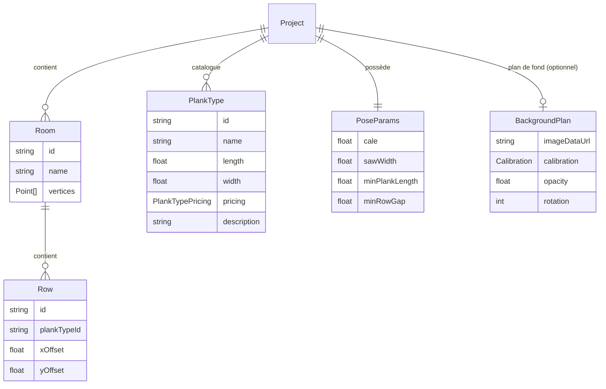

# Modèle de données

## Principe

**Seules les données saisies par l'utilisateur sont stockées.** Tout ce qui peut être dérivé est recalculé à chaque rendu. Cette approche élimine les problèmes de désynchronisation entre données stockées et données dérivées.

## Ce qui est stocké dans IndexedDB

Les entités stockées forment un arbre enraciné sur `Project`. IndexedDB stocke les projets comme des objets JSON sérialisés intégralement — pas de base relationnelle.

```typescript
interface Row {
  id: string
  plankTypeId: string
  xOffset: number   // seul paramètre de position, en cm
  yOffset?: number  // décalage vertical optionnel (continuité inter-pièces)
}
```

## Ce qui est recalculé à chaque rendu

| Donnée | Fonction | Source |
| --- | --- | --- |
| `Plank[]` | `fillRow(xOffset, ...)` | `xOffset` + dimensions du type |
| Liens de réutilisation | `computeOffcutLinks()` | Comparaison des `xOffset` par type |
| `ConstraintViolation[]` | `validateRow()` | `Plank[]` + `PoseParams` |
| Résultats financiers | `computeSummary()` | `Plank[]` + tarifs du catalogue |

## Schéma entité-relation



## Notes

- `PlankType` est référencé depuis `Row` par son `id`. Au rendu, l'algorithme résout cette référence via `project.catalog`.
- `BackgroundPlan` est positionné sur `Project` (et non sur `Room`) car un seul plan de fond par projet suffit en pratique.
